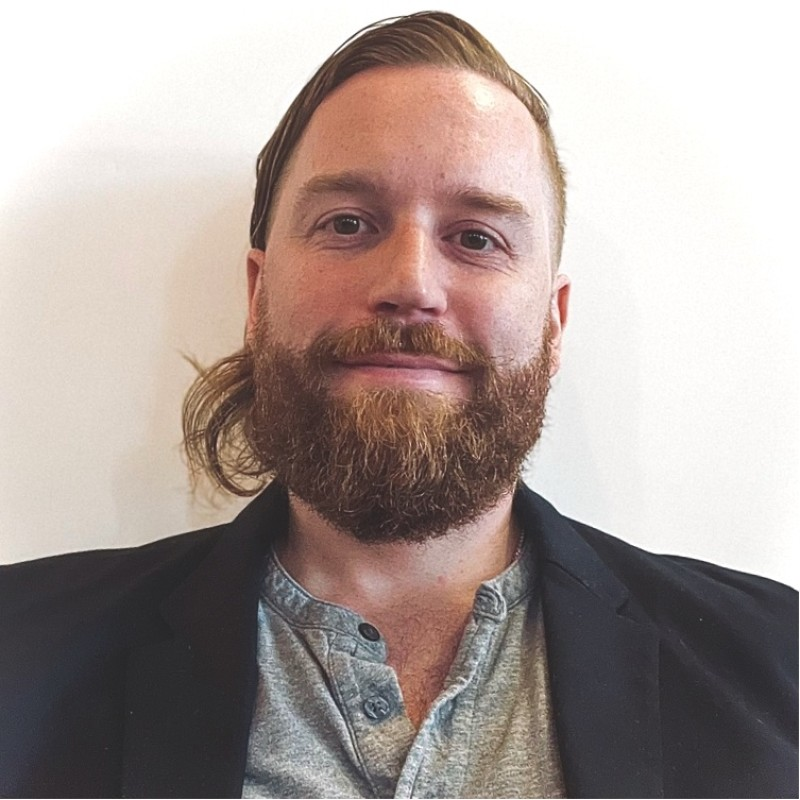

# Preface {.unnumbered}

 

Dear reader,

**This book attempts to curate a selection of social science that can be applied
to solving the challenge of our age: organizing ourselves into a sustainable
existence.** This book began as course notes for various Stanford Doerr School
of Sustainability courses I was commissioned to develop and teach. 

_Sustainability_ is a risky word, perhaps already rendered meaningless to you,
dear reader. Perhaps you've seen too many greenwashing campaigns, had your 
mind twisted into a migraine by empty promises from cynical tech billionaires 
who've long promised to "make the world a better place". 

This book seeks to reclaim sustainability and define it rigorously
in a formal system that takes the good of the minoritized and marginalized as
a first principle. The book shows how to use math and software to 
design self-sustaining social systems by simulating their 
mathematical and digital twins.

Different ways to structure educational outreach—such as who in a population
should be educated directly—can be tested in low-cost simulations. The
simulations provide a method to triage alternate intervention strategies,
prioritizing those that performed best in simulations for real-world deployment.

It may seem distasteful to talk about engineering social organization. After
studying the social and political moment a bit, I believe that we can either
choose how to socially organize ourselves, or someone else will choose for us.

**To make sustainability concrete, I adopt a definition by enumeration for
sustainability, guided by the United Nation's 17 Sustainable
Development Goals.** These include healthcare, food security, gender equality,
education, and clean water as foundational basic needs that institutions can
help provide.
Many of the Sustainable Development Goals are necessary conditions, like those
I listed, for climate action and ecological protection. 

Some might argue that the ecology is more basic since, yes, climate change will
cause new climate refugees who lack the basics. But that does mean that 
are not _consequences_ of environmental health, but the necessary conditions
people need to **claim** the freedom to care about environmental
and ecological problems in the first place. 
One cannot participate in climate action if they walk two hours for water daily, if they have
dysentery, if they are threatened by sexual violence.

**This book develops a
consolidated system of quantitative social science to more readily solve
pressing practical problems like promoting public health, and also to accelerate
the development of social science theory and techniques to rigorously organize
ourselves.** I believe it is our duty to proactively prepare to lead the 
next chapter in human history so that future generations do not look at us like
we are currently looking at the sclerotic gerontocracy that gave us more than a
decade of feeble-bodied and -minded presidents. It's like everyone's hypnotized
sometimes. 

It's our responsibility as social scientists who have benefitted from
public-supported education our whole lives, plus many comforts of life in the
US and other capitalist countries in this first quarter of the 2000s. It seems
to be our job now to revitalize and rebuild so that the youth of today and 
tomorrow look to their leaders and see competence and style, instead of 
buffoonery and decay. I for one am energized by the challenge.

One problem with attempting to synthesize social science or any selection of
behavioral science is the recent Cambrian explosion of research, with 
few scientists equipped and free to formally analyze social science canon. 

It's the serious responsibility of established scientists to tamp down wild,
unrigorous, but potentially laudable attempts at synthesis. For example, Paul
Smaldino wrote a teasing, skeptical, but overall supportive book review called
"It's All Connected, Man", of César Hidalgo's _Why Information Grows: The
Evolution of Order, from Atoms to Economies_ [@Smaldino2016]. 

With his teasing title, Paul hints that while Hidalgo may have stitched together
an interesting and stimulating read, Hidalgo does not manage to tightly and
rigorously stitch them together. Paul's title suggests Hidalgo's philosophy
would be at home at my high school's "smoke pit", down the slope from the
football field, where stoner burnouts used to lay round about 4:20 PM after
school. I fear that I, too, will get tangled up in my ambitions, falling, too,
in the academic careerist's smoke pit, down the slope from Harvard yard where
junkies do drugs by the Charles, a stoner burnout not fit for academia or even,
gasp, industry.

But really, dear reader, I humbly believe that you will find this book to be the
opposite of handwaving: the contents are developed _rigorously_. Only recently,
years after my PhD, did I start to wonder how senior social scientists' arms
don't get tired after so much handwaving at multi-day conferences. 
It seems many prominent social scientists have hand-waved themselves into a
trance of self-deception where they believe their models and theories are
practically absolute truth because they are "scientific." 

To arrive at the concept for this
book, I had to recognize that their mistake is taking the falsificationist
model of science too seriously, which assumes that one theory subsumes an
alternate when it can better predict some observations that the alternate fails
to predict. Perhaps some subsets of physics work like this, but this model is a
miserable failure for describing how social science works. Social
science demands pluralism, meaning lots of different theories and models, 
because it encompasses many orders of magnitude of
space and time, with many more independent components that interact in complex
ways. 

**I get a handle on the complexity of social change by first organizing it into two
orthogonal categories: _behavior change_ and _opinion change_.** "Behavior" is a
stand-in for any practice that could be directly observed in the real world.
Opinion stands in for any belief or attitude that cannot be directly observed—if
these exist at all, they exist in the brain-body alone. We can directly ask
people survey questions to learn their opinions [@Zaller1992]; or we can infer
opinions from behavior, like in the [implicit association test
(IAT)](https://implicit.harvard.edu/implicit/takeatestv2.html), where
differences in keypress times matching black or white children's faces with
pleasant or unpleasant words represents an _implicit bias_ against black
children [@Greenwald1998;@Greenwald2009].

Second, to reduce complexity I present one common mathematical formalism 
for _behavior change_ and another for _opinion change_. 
The formalism of behavior change is called the _prevalence dynamic_. It relates
the change in the prevalence of behaviors to the number doing now, plus the
number who learn a behavior to adopt it, how many keep doing their current
behavior versus drop the behavior for some alternative.
In the book I show that the prevalence dynamic is formally equivalent to the
replicator dynamic originally developed to describe biological and genetic 
population dynamics (@McElreathBoyd2007_MathModSocEvo 
provide a representative review of the replicator dynamic for cultural
evolution). 

Since opinions do not replicate like behaviors do, and measurement of opinions
is non-trivial, they demand a different formalism. In fact, these complications
seem to have greatly affected the science of opinion change. Evolutionary
scientists ready to show sociologists how it's done will encounter the hard fact
that "opinions" don't exist in the same way a behavior does. 

Opinions appear to be _constructed_ at the time they are required. Consider the
following example to see why: you're
stuck in traffic because of a crash and you have to consider the GPS and your
experience and judgement to decide which you believe will be better: to take the
alternate route or not? In such a case we cannot possibly think about every 
opinion we'll need for wherever we'll break down in whatever situation since
there are infinitely many possible contexts where we'll need an opinion like
that. Therefore our opinion about them must be constructed.

Political scientists found that people answer survey questions differently
depending on their order, and also answer the same question differently over
time, even though they verbally report that their political views have not
changed. All this unresolved _opinion instability_ as political scientists call
it suggests that opinions and opinion change are anything but a solved problem.

Thank you for your time and attention. We only have so many moments in
life, only so many flits of the eye. I recognize you could be spending it
another way.

I love hearing feedback, especially at this stage. I am currently releasing
the book in parts, collecting reviews as I publish different chunks.
I would super appreciate any time or effort you spent sending 
thoughts [by email to me](mailto:mat.phd@pm.me).

 

{.float-left height=160px}

_With sincere gratitude and hope for the future,_

{width=210px}

_Matt Turner_\

[https://mat.phd](https://mat.phd)\
[contáctame por email](mailto:matt@mat.phd)

Co-Founder and Co-Director, [Instituto Dourados](https://institutodourados.org)\
Founder and Architect, [GPD Américas](https://gpdamericas.org)\
Founder and President, [SubtleTea Solutions](https://subtleteasolutions.com)

24 March 2026\
Merced, California

